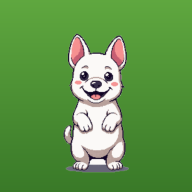
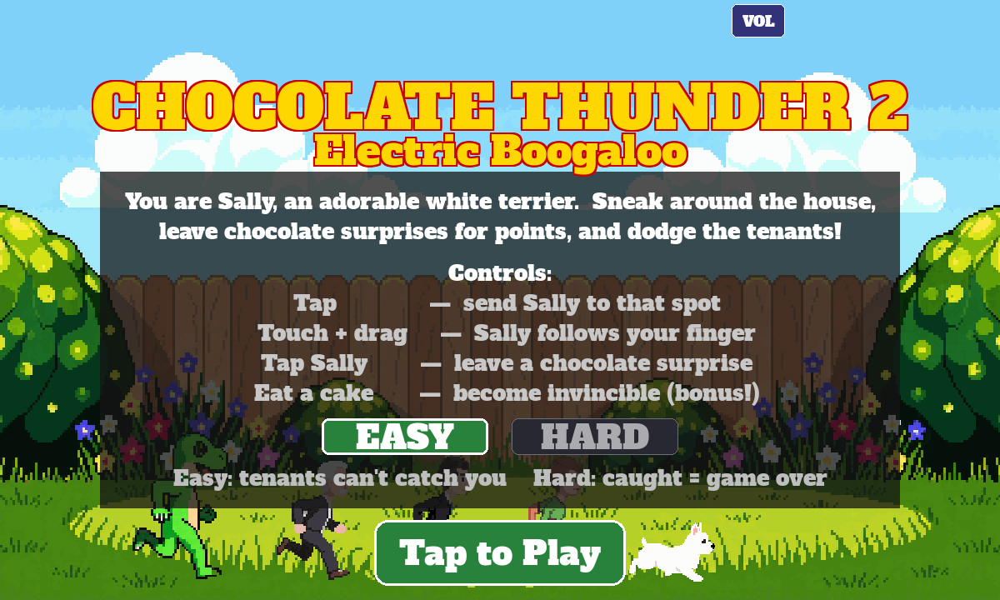
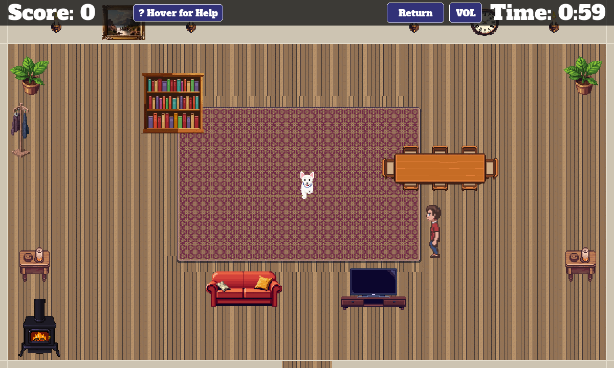
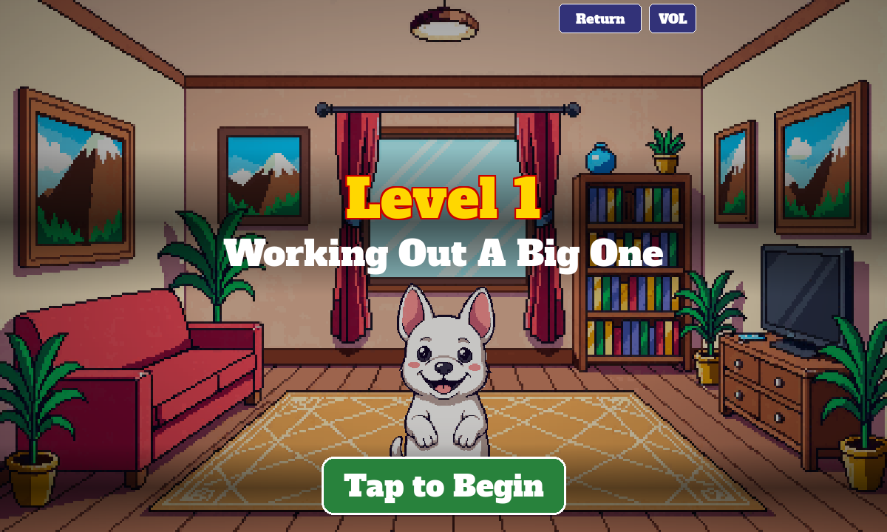
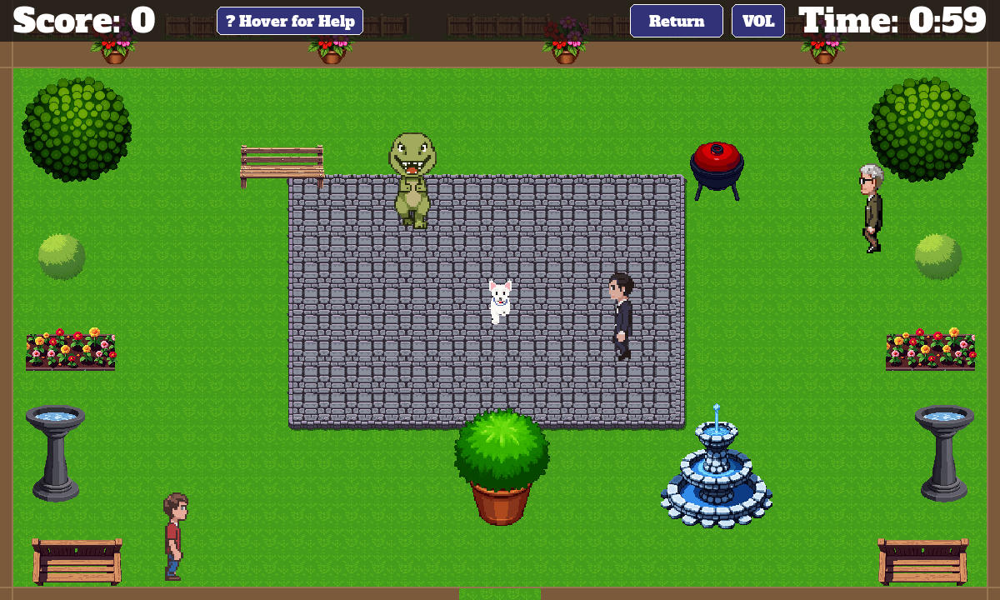
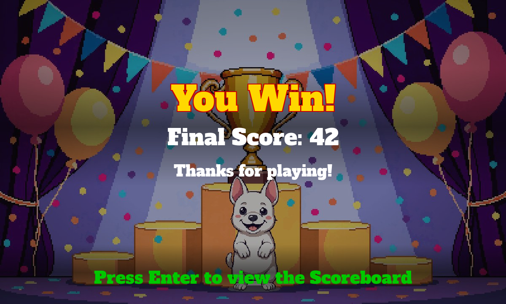
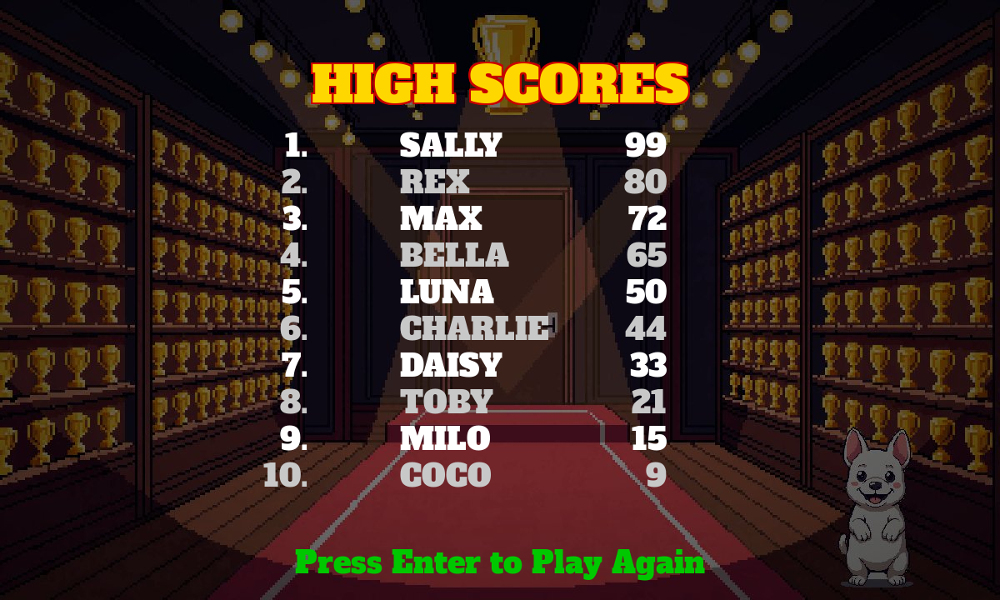

# Sally's Revenge

You are **Sally**, an adorable white terrier. Sneak around the house, leave
"chocolate surprises" for points, eat cake for a real invincibility boost, and
dodge the tenants — across four themed levels (living room, gym, Japanese
room, backyard… featuring a T-rex tenant).

Runs as a **native desktop game** (Python + pygame-ce), in the **browser**
(WebAssembly via pygbag), and as an **iPad app** (Capacitor shell or
installable PWA) with a full touch-control layer.

An improved rebuild of the original *Chocolate Thunder* class project. The
original in `../ChocolateThunder/` is **ground truth** (feel, audio) and is
never modified; the art was upgraded to a PixelLab-generated set.

## Screenshots

| | |
|:---:|:---:|
| <br>**Start screen** — Sally flees the tenants (and the T-rex) | <br>**Level 1** — leave surprises, dodge the tenant |
| <br>**Level intro card** (touch build: tap buttons) | <br>**Level 4** — the backyard, 4 tenants incl. the T-rex |
| <br>**Win screen** | <br>**Top-10 leaderboard** |

## Requirements

- **Python ≥ 3.10** (developed on 3.13). Uses `pygame-ce` — do not also install upstream `pygame`.
- For the iPad app only: macOS with Xcode (free), Node.js, and an iOS
  simulator runtime (`xcodebuild -downloadPlatform iOS`).

## Setup

```bash
python3.13 -m venv .venv
source .venv/bin/activate
pip install -r requirements.txt
```

## How to play

| Desktop | iPad / touch |
|---|---|
| Click (or click-drag, or arrow keys) — move Sally | Tap or drag — Sally follows your finger |
| **Space** — leave a chocolate surprise | **Tap Sally** — she puffs up and leaves a surprise |
| Eat a cake — invincibility (+5 per surprise while powered) | same |
| **Easy**: tenants can't end the game · **Hard**: caught = game over | same — pick on the start screen |

Tenants step on a *powered* surprise → splat, and they slow to a crawl.
Survive each level's countdown to advance; top-10 scores persist.

## Run it

```bash
./run.sh          # desktop game            (zsh alias: ct2_desktop)
./run_test.sh     # 16-screen UI walkthrough (zsh alias: ct2_test)
./run_ipad.sh     # build + launch in iPad simulator (zsh alias: ct2_ipad)
```

**Browser (WASM):** build once, then serve — port 8000 is required:

```bash
./scripts/build_web.sh
python3 -m http.server 8000 -d build/web    # open http://localhost:8000
```

The bundle is fully self-contained (the pygbag runtime is mirrored into
`build/web/cdn/` at build time) — the shipped game makes **zero network
requests**.

**iPad simulator:** `./run_ipad.sh` builds the web bundle, wraps it with
Capacitor, boots the simulator (default *iPad Air 11-inch (M2)* — override
with `CT2_IPAD_DEVICE="iPad Pro 13-inch (M4)"`), installs, and launches.
The game takes ~20 s to boot to the start screen.

## Install on iPad

### Recommended — PWA via GitHub Pages (free, permanent, no Mac required)

The game is automatically deployed to GitHub Pages on every push. The iPad
installs it once and plays fully offline from then on — no Mac, no expiry,
no re-signing.

**One-time install on the iPad:**

1. Open **Safari** on the iPad and go to:
   `https://erickcap14.github.io/ChocoThunder2/`
2. Tap the **Share** button (box with arrow pointing up).
3. Tap **Add to Home Screen**.
4. Tap **Add**.

That's it. The game icon appears on the home screen and launches like a
native app — fullscreen, no browser chrome, works offline.

**Updating the game:** push a code change to `master` → GitHub rebuilds
automatically → the iPad pulls the update silently in the background next
time it has Wi-Fi.

---

### Alternative — native app via free Xcode provisioning (expires every 7 days)

A free Apple ID can sideload the native Capacitor shell onto your iPad.
Certificate expires after **7 days** and must be renewed from Xcode.

1. `./scripts/build_ios.sh` — builds the web bundle and stages it into the
   Xcode project.
2. `open ios-app/ios/App/App.xcodeproj`
3. Xcode ▸ Settings ▸ **Accounts** ▸ “+” ▸ sign in with your Apple ID
   (creates a free *Personal Team*).
4. Select the **App** target ▸ *Signing & Capabilities* ▸ check
   **Automatically manage signing** ▸ Team = your Personal Team.
5. Connect the iPad via USB, unlock it, tap **Trust**.
6. On the iPad: Settings ▸ Privacy & Security ▸ **Developer Mode** → on
   (appears after the first deploy attempt; requires a reboot).
7. Pick the iPad as the run destination in Xcode and press **Run** (⌘R).
8. First launch only: Settings ▸ General ▸ **VPN & Device Management** ▸
   trust your developer certificate.

## Test

```bash
pytest -q     # 176 headless pygame unit + MCP-verify tests
```

Screenshots from MCP-verify tests are written to `testscreenshots/`
(committed to git).

## Game State MCP (automated control & verification)

A FastMCP sidecar lets Claude Code drive the running game via file-based IPC.

```bash
python -m mcp_server.server     # start the MCP server (also wired via .claude/settings.json)
python main.py --smoke          # headless harness to validate the bridge without a window
```

Tools include `get_state`, `jump_to_{start,transition,running,end,scoreboard}`,
`set_level`, `spawn_powerup`, `spawn_npc`, `drop_poo`, `set_invincible`,
`toggle_music`, `toggle_sfx`.

## Project layout

| Path | Purpose |
|------|---------|
| `main.py` | Desktop entry point + game loop (`write_state` → `poll_mcp_command` each frame) |
| `web_main.py` | WASM/browser entry point (async loop) |
| `game/` | Engine: config, state machine, entities, screens, levels, audio, scores |
| `pixellab/` | PixelLab-generated art set (maps, characters, obstacles, transitions, UI) |
| `assets/` | Ground-truth fonts/audio + fallback art |
| `web/` | pygbag loader template, PWA manifest, icons |
| `ios-app/` | Capacitor iPad shell (Xcode project, SPM) |
| `scripts/` | `build_web.sh`, `build_ios.sh`, `make_icons.py`, render/dev tools |
| `mcp_server/` | `state_bridge.py` (IPC) + `server.py` (FastMCP tools) |
| `tests/` | Pure unit tests + MCP-verify (screenshot) tests |
| `testscreenshots/` | Committed verification screenshots |
| `.implementations/` | Runtime IPC + logs (gitignored) |

See `.claude/prd.md` for the full design and fixed-bug appendix, and
`.claude/changelog.md` for the development history.
